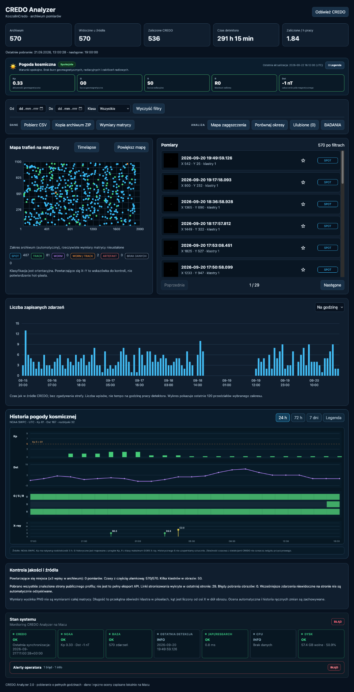
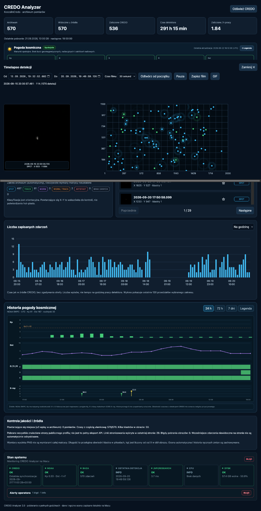
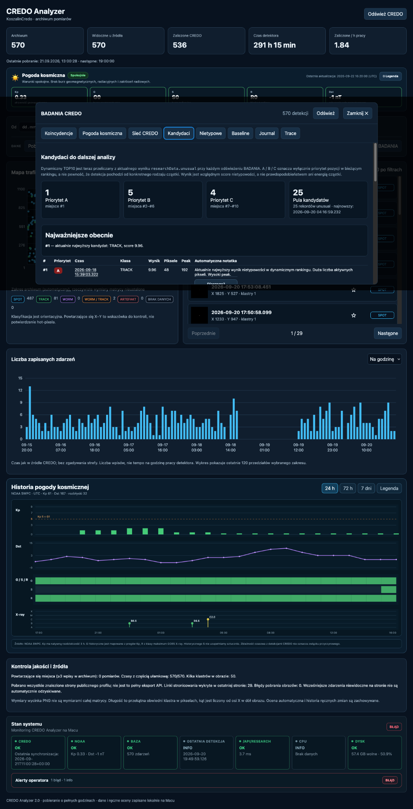

# CREDO Analyzer

Local analysis and visualization software for detections associated with
the CREDO (Cosmic-Ray Extremely Distributed Observatory) ecosystem.

## Status

This repository is being prepared from an operational local installation.

The current public-preparation phase focuses on:

- reproducibility
- source-code provenance
- privacy-safe publication
- performance auditing
- portability
- test coverage
- documentation for human and AI contributors

## Main components

Backend:

`app/server.py`

Frontend:

`app/index.html`
`app/app.js`
`app/features.js`
`app/timelapse.js`
`app/style.css`

Additional components:

`app/network_import.py`
`app/legacy.py`

## Third-party code

This project contains an unmodified upstream CREDO utility:

`app/credo-data-exporter_universal.py`

Its exact origin, Git blob and license are documented in:

`CODE_PROVENANCE.yaml`
`THIRD_PARTY_NOTICES.md`

AI coding agents should also read:

`AGENTS.md`

## Runtime data

Runtime databases, downloaded detection images, logs, caches, backups
and local Python environments are deliberately excluded from Git.

A fresh installation must create or acquire its own runtime data.

## Known audited environment

The production installation audited on 2026-09-22 ran on:

- macOS 12.7.6
- Intel x86_64

Cross-platform support must be verified independently.

## Development status

The current implementation contains historically grown modules,
including a large backend and frontend feature file.

The initial public snapshot aims to preserve behaviour.

Modularization and performance work should be performed incrementally
and documented in separate commits.

## License

Project-local CREDO Analyzer code is released under the MIT License.

Copyright (c) 2026 `Tomasz`.

See the root `LICENSE` file.

Third-party components retain their original licenses and copyright
notices. See `THIRD_PARTY_NOTICES.md` and `LICENSES/`.

## Screenshots

### Dashboard

### Detection timelapse

### Research candidates

